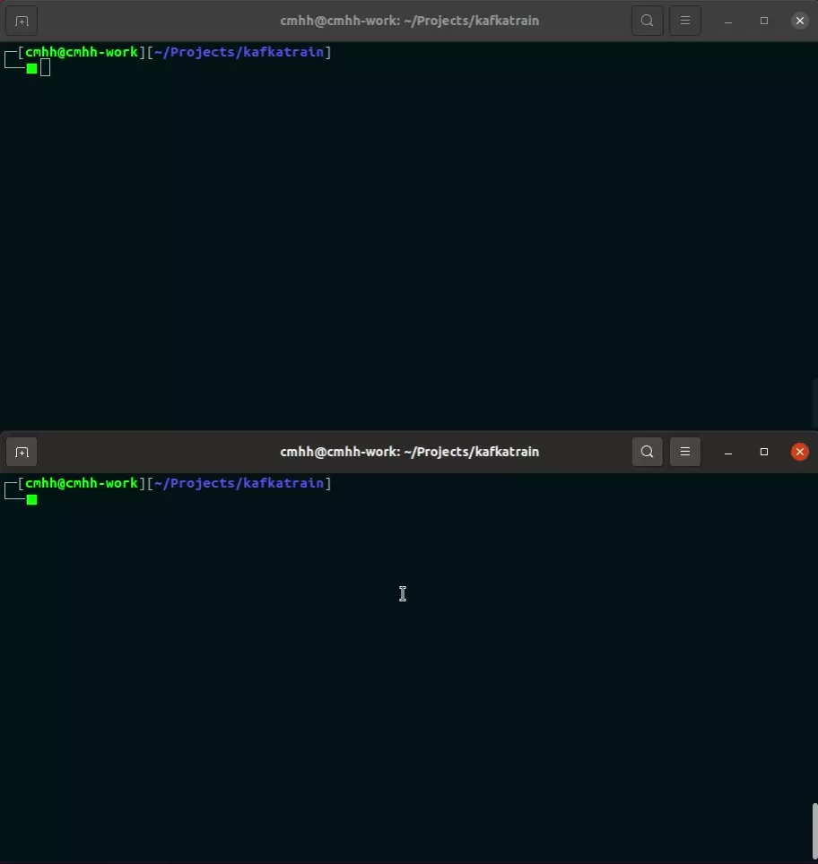

# Online Learning with [Apache Kafka](https://kafka.apache.org/)

This repository contains a simple producer application which loads the [MNIST](http://yann.lecun.com/exdb/mnist/) training set into a Kafka topic, and a simple consumer application which polls the topic and uses the images retrieved to update a simple text classifier.  The classifier is a neural net, build via [Deeplearning4j](https://deeplearning4j.org/).

To build the application, run:

```bash
sbt assembly
```

This will produce `target/scala-2.13/kafkatrain.jar`, which can be used like any other jar.  To start the producer:

```bash
java -cp target/scala-2.13/kafkatrain.jar org.cmhh.ProducerApp [delay in ms between messages]
```

And to start the consumer:

```bash
java -cp target/scala-2.13/kafkatrain.jar org.cmhh.ConsumerApp
```

Note that dl4j is _huge_, so a fat jar will weigh in at well over 1GB.  Modify `build.sbt` if you have dl4j already in your classpath.  Also note that the dependencies are configured to use the CUDA back-end for dl4j, but the CPU back-end can be used instead (and is in `project/dependencies.scala`, but commented out).

